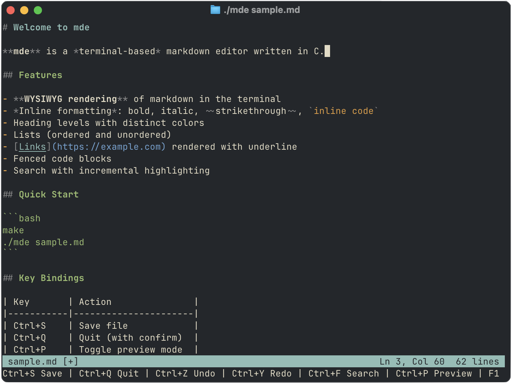
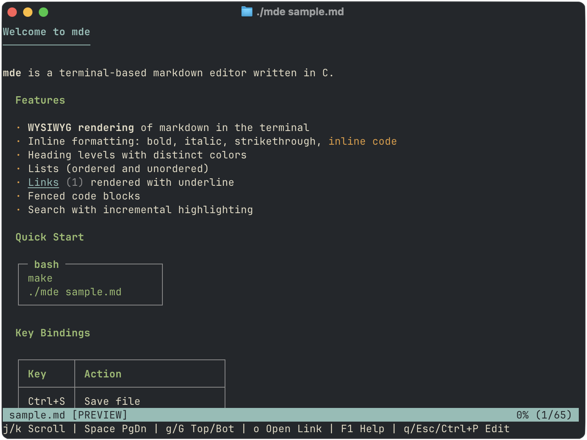

# mde

A terminal-based markdown editor written in C. Edit and preview markdown files without leaving the terminal.


## Features

- **Live syntax styling**: headings, bold, italic, strikethrough, inline code, links, lists, blockquotes, code blocks, and horizontal rules are coloured and styled as you type; markdown delimiters are dimmed so the content stays readable
- **Preview mode**: Ctrl+P renders a read-only view with syntax markers hidden, man-page-style heading indentation, and box-drawing table borders; Ctrl+F search with highlighted matches and Ctrl+N navigation without leaving preview mode
- **Todo items**: GFM-style task checkboxes (`- [ ]` open, `- [x]` done) with coloured styling; metadata tokens highlighted — `#tag`, `@assignee`, `~duration`, and `yyyy-mm-dd` dates
- **List autocompletion**: pressing Enter on a list item starts the next item automatically — `- `, `* `, `+ ` for unordered; incremented numbers for ordered (`1.` → `2.`, `1)` → `2)`) with indentation preserved; pressing Enter on an empty list item exits the list
- **Word wrap**: Ctrl+W toggles character-level wrapping at the terminal width, in both edit and preview mode
- **Table of Contents**: Ctrl+T opens a navigable TOC panel listing all headings; press Up/Down to navigate, Enter to jump to the selected heading
- **Incremental search**: Ctrl+F with live match highlighting, Ctrl+N to jump to the next match — works in both edit and preview mode
- **Undo/redo**: full undo history with Ctrl+Z / Ctrl+Y; operations like list continuation undo atomically
- **Open files and links**: Ctrl+O to open a different file (with tab completion), Ctrl+L to open a link by number
- **Status bar**: filename, cursor position, line count, dirty indicator

## Requirements

- A C99 compiler (gcc or clang)
- ncurses development library
  - **macOS**: included with Xcode Command Line Tools
  - **Debian / Ubuntu**: `sudo apt install libncurses-dev`
  - **Fedora**: `sudo dnf install ncurses-devel`
  - **Arch**: `sudo pacman -S ncurses`

## Building

```bash
make
```

Produces the `mde` binary in the project root. To clean build artifacts:

```bash
make clean
```

## Usage

```bash
./mde file.md       # open an existing file
./mde               # start with an empty buffer
./mde sample.md     # try the included sample
```

## Key Bindings

### Edit Mode


*Edit mode: markdown syntax with dimmed delimiters*

| Key               | Action                                  |
|-------------------|-----------------------------------------|
| Ctrl+P         | Toggle to preview mode          |
| Ctrl+S         | Save file                       |
| Ctrl+Q         | Quit (press twice if unsaved)   |
| Ctrl+Z         | Undo                            |
| Ctrl+Y         | Redo                            |
| Ctrl+F         | Search                          |
| Ctrl+N         | Find next match                 |
| Ctrl+G         | Go to line number               |
| Ctrl+O         | Open a different file           |
| Ctrl+L         | Open link by number             |
| Ctrl+T         | Open Table of Contents          |
| Ctrl+W         | Toggle word wrap                |
| Ctrl+K         | Delete to end of line           |
| Ctrl+A         | Move to beginning of line       |
| Ctrl+E         | Move to end of line             |
| Ctrl+H         | Delete character (backspace)    |
| Tab            | Insert 4 spaces                 |
| Arrow keys     | Move cursor                     |
| Home / End     | Beginning / end of line         |
| Page Up / Down | Scroll by screen height         |
| Escape         | Switch to preview mode          |
| F1             | Show help                       |

### Preview Mode


*Preview mode: read-only rendered view*

| Key              | Action                                 |
|------------------|----------------------------------------|
| Ctrl+P           | Toggle to edit mode                    |
| Ctrl+F           | Search (highlights matches)            |
| Ctrl+N           | Find next match                        |
| Ctrl+S           | Save file                              |
| Ctrl+G           | Go to line number                      |
| Ctrl+Z           | Undo                                   |
| Ctrl+Y           | Redo                                   |
| Ctrl+O           | Open a different file                  |
| Ctrl+L           | Open link by number                    |
| Ctrl+T           | Open Table of Contents                 |
| Ctrl+W           | Toggle word wrap                       |
| Ctrl+Q           | Quit (press twice if unsaved)          |
| Arrow Up / Down  | Scroll one line                        |
| Shift+Up / Down  | Scroll 10 lines                        |
| Page Up / Down   | Scroll one page                        |
| Home / End       | Jump to top / bottom                   |
| F1               | Show help                              |

## Supported Markdown

| Element          | Syntax                          | Notes                          |
|------------------|---------------------------------|--------------------------------|
| Headings         | `# H1` through `###### H6`     | Bold, coloured per level       |
| Bold             | `**text**`                      |                                |
| Italic           | `*text*`                        |                                |
| Bold + italic    | `***text***`                    |                                |
| Strikethrough    | `~~text~~`                      | Rendered dimmed                |
| Inline code      | `` `code` ``                    |                                |
| Code blocks      | Fenced with `` ``` ``           |                                |
| Links            | `[text](url)`                   | Text underlined, URL dimmed    |
| Images           | ``                   | Same as links                  |
| Unordered lists  | `- item`, `* item`, `+ item`    | Autocompletion on Enter        |
| Ordered lists    | `1. item`, `1) item`            | Auto-increments on Enter       |
| Todo items       | `- [ ] task`, `- [x] done`      | Checkbox coloured; `#tag` `@name` `~dur` `yyyy-mm-dd` highlighted |
| Blockquotes      | `> text`                        |                                |
| Horizontal rules | `---`, `***`, `___`             |                                |
| Tables           | GFM pipe syntax                 | Box-drawing borders in preview |

## Architecture

```
src/
  main.c        — entry point: locale init, constructs Editor, opens file, runs event loop
  editor.h/c    — Editor struct, event loop, key dispatch, file I/O, search, mode switching
  buffer.h/c    — line-based text buffer; dynamic array of heap-allocated lines
  render.h/c    — markdown parser and ncurses output for edit mode; generates PreviewBuffer
  undo.h/c      — append-only undo stack; sequence numbers group per-keystroke operations
  search.h/c    — incremental search with match tracking
  utf8.h/c      — UTF-8 character boundary helpers
  preview_ui.h  — preview and help mode rendering
```

Files are saved as standard `.md`; the editor never writes rendered output.

## License

MIT
